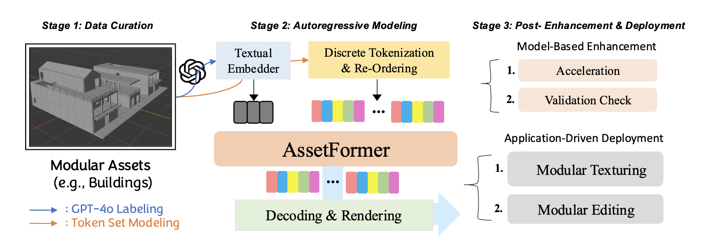

# AssetFormer: Modular 3D Assets Generation with Autoregressive Transformer (ICLR 2026)

This is the official code for [**AssetFormer: Modular 3D Assets Generation with Autoregressive Transformer**](https://arxiv.org/abs/2602.xxxxx).

## Abstract

The digital industry demands high-quality, diverse modular 3D assets, especially for user-generated content (UGC). In this work, we introduce **AssetFormer**, an autoregressive Transformer-based model designed to generate modular 3D assets from textual descriptions. Our pilot study leverages real-world modular assets collected from online platforms. AssetFormer tackles the challenge of creating assets composed of primitives that adhere to constrained design parameters for various applications. By innovatively adapting module sequencing and decoding techniques inspired by language models, our approach enhances asset generation quality through autoregressive modeling. Initial results indicate the effectiveness of AssetFormer in streamlining asset creation for professional development and UGC scenarios. This work presents a flexible framework extendable to various types of modular 3D assets, contributing to the broader field of 3D content generation.



## Installation & Preparation

1. Clone this repository and install packages:
    ```
    git clone https://github.com/Advocate99/AssetFormer.git
    conda create -n assetformer python=3.12
    conda activate assetformer
    pip install -r requirements.txt
    ```

2. Download flan-t5-xl models from [flan-t5-xl](https://huggingface.co/google/flan-t5-xl) and put into the folder of `./pretrained_models/t5-ckpt/`:
    ```
    huggingface-cli download google/flan-t5-xl --local-dir ./pretrained_models/t5-ckpt/flan-t5-xl
    ```

3. Download the pretrained model from [ltzhu/AssetFormer](https://huggingface.co/ltzhu/AssetFormer) and put into the folder of `./pretrained_models/`:
    ```
    huggingface-cli download ltzhu/AssetFormer --local-dir ./pretrained_models
    ```

## Inference

1. Run the following command to sample 3D assets json files:
    ```
    python sample.py --gpt-ckpt ./pretrained_models/inference_model.pt
    ```

2. Use blender script to render the 3D assets in blender with the modular fbx files. The script is located in `./blender_script/`.


## Citation

If you find our work useful, please kindly cite as:
```
@article{zhu2026assetformer,
  title={AssetFormer: Modular 3D Assets Generation with Autoregressive Transformer},
  author={Zhu, Lingting and Qian, Shengju and Fan, Haidi and Dong, Jiayu and Jin, Zhenchao and Zhou, Siwei and Dong, Gen and Wang, Xin and Yu, Lequan},
  journal={arXiv preprint arXiv:2602.xxxxx},
  year={2026}
}
```

## Acknowledgement
* The codebase is developed based on [LlamaGen](https://github.com/FoundationVision/LlamaGen).